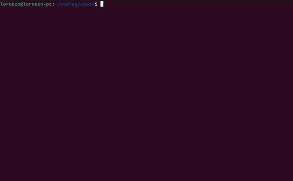

# CLI Chess

Chess board game written in Ruby.

## Demo


## Overview

This is a command line interface for a chess board game. The game can be either played Human vs Human, or Human vs Computer.

In order to run this project, be sure to have Ruby installed on your local machine. If you don't have it already, go through
[this guide](https://www.ruby-lang.org/en/documentation/installation/) to set it up.

The project uses Rspec for testing. If you are not familiar with this testing framework and want to know more, take a look at the [Rspec documentation](https://rspec.info/).

## Installation and usage

### With RubyGems

Install the gem with
```
$ gem install cli_chess
```

And launch the game with
```
$ bundle exec cli_chess
```

### With Git

First clone this repository on your local machine

```
$ git@github.com:Uaitt/cli_chess.git
```

Move to the project directory

```
$ cd cli_chess/
```

Install the gem dependencies
```
$ bundle install
```

Launch the application
```
$ exe/cli_chess
```

Follow the instruction in the terminal and have fun!

## Disclaimer

The code of this project is probably a mess and a bowl of spaghetti. But please, be gentle on me.

This was my first ever really big project, and I wrote it while I was still learning Ruby. Considering my skill level at that time, the fact that I even finished this project is a win for me :).

## License

The gem is available as open source under the terms of the [MIT License](https://opensource.org/license/mit/).
